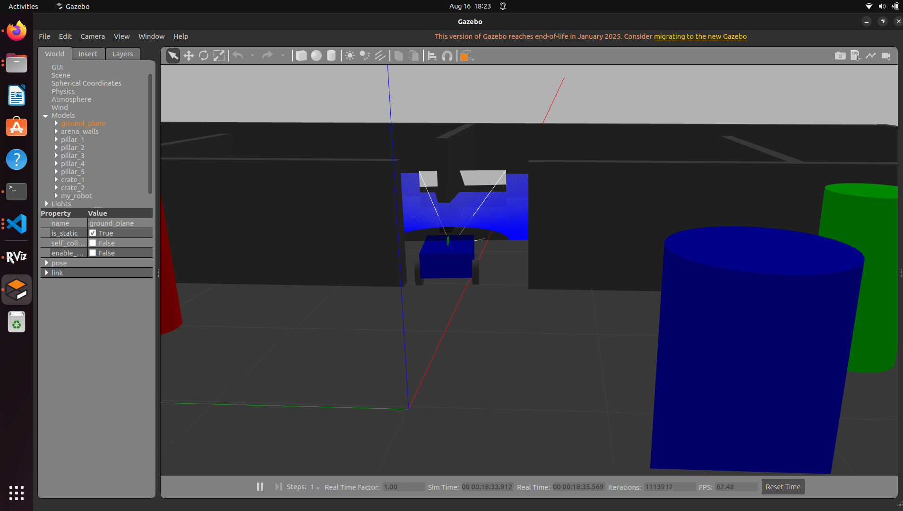
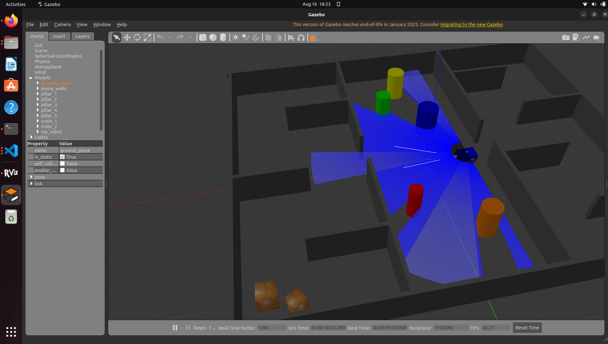
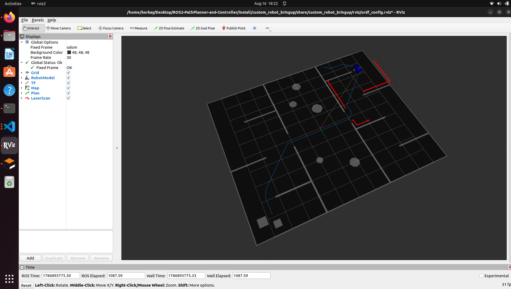

# ROS2 Path Planner & Controller

A custom differential-drive robot simulated in Gazebo, with a hand-written **A\* global planner** and a **Pure Pursuit** local controller driving it through a multi-room custom world — all visualized live in RViz.

## Demo

### End-to-end run

Clicking a goal in RViz ("2D Goal Pose") and watching A\* plan the route while Pure Pursuit drives the robot there:

<video src="https://github.com/Berkay-Ates/ROS2-PathPlanner-and-Controller/raw/master/images/demo.mp4" controls muted width="700"></video>

### Screenshots

| | | |
| --- | --- | --- |
|  |  |  |
| Gazebo — open room, pillars | Gazebo — maze/slalom rooms, LiDAR cone | RViz — map + A\* plan + LaserScan |

## Overview

The robot (URDF/Xacro, diff-drive base + LiDAR + camera) is spawned into a custom Gazebo world and driven with a classic two-stage navigation stack:

1. **`path_planner_node`** — subscribes to `map` (`nav_msgs/OccupancyGrid`), `odom`, and `goal_pose`. On every new goal it inflates the obstacle cells for safety margin, runs 8-connected **A\*** over the grid, smooths the result with Catmull-Rom interpolation, and publishes it once as a `nav_msgs/Path` on `plan`.
2. **`pure_pursuit_controller_node`** — subscribes to `odom` and `plan`, and at a fixed control rate chases a lookahead point along that path, publishing `cmd_vel`.

Both are plain C++ (`rclcpp`), since the planner does real per-cell grid work (A\* + inflation) where that pays off, while the controller's per-tick loop is light enough that the language barely matters.

## Packages

| Package | Type | What it does |
| --- | --- | --- |
| `custom_robot_description` | C++/URDF | Robot model (Xacro): differential-drive base, LiDAR, camera, RViz display config |
| `custom_robot_bringup` | launch/worlds | Gazebo + RViz bring-up, the custom `complex_world.world`, spawn logic |
| `path_planner_controller` | C++ | `path_planner_node` (A\*), `pure_pursuit_controller_node`, plus a Python `world_map_publisher.py` helper (see below) |
| `lidar_driver` | C++ | `lidar_subscriber_node` — reads `/scan`, logs range/intensity data |
| `camera_driver` | C++ | `camera_subscriber_node` — reads `/camera_sensor/image_raw` |

## The world: `complex_world.world`

A 12m × 10m arena split into three connected rooms, built specifically to stress-test the planner/controller pair:

- **Maze room** — a zig-zag corridor made of alternating wall baffles.
- **Open room** (robot spawn point) — scattered cylindrical pillars of different sizes/colors for basic obstacle clearance.
- **Slalom + goal room** — another baffle zig-zag ending in an alcove with a couple of crates.

Rooms are connected through 1m-wide gated openings.

## The map: `world_map_publisher.py`

There's no SLAM/`map_server` in this project — `path_planner_node` needs an `OccupancyGrid` to plan on, so `world_map_publisher.py` (a small standalone `rclpy` script) rasterizes the exact same wall/pillar coordinates from `complex_world.world` into a `nav_msgs/OccupancyGrid` and republishes it on `map` at 1 Hz (transient-local QoS, so RViz's Map display picks it up on late join too). It's intentionally a script, not a full package node — it only needs to exist for as long as there's no real localization/mapping stack.

> ⚠️ Because the map is a hand-authored mirror of the world file, if you ever edit `complex_world.world`'s geometry, update the `WALLS`/`PILLARS` lists in `world_map_publisher.py` to match.

## How to run

```sh
colcon build --symlink-install
source install/setup.bash

# 1) Gazebo + robot + RViz
ros2 launch custom_robot_bringup custom_robot_gazebo.launch.xml

# 2) the synthetic map (separate terminal)
python3 src/path_planner_controller/scripts/world_map_publisher.py

# 3) planner + controller (separate terminal)
ros2 launch path_planner_controller path_follow.launch.py
```

Then send a goal either of two ways:

- **In RViz**, click **2D Goal Pose** on the toolbar and click-drag on the map.
- **From a terminal**:

  ```sh
  ros2 topic pub --once /goal_pose geometry_msgs/msg/PoseStamped \
    "{header: {frame_id: 'odom'}, pose: {position: {x: 2.6, y: -4.3, z: 0.0}, orientation: {w: 1.0}}}"
  ```

### Useful tuning parameters

| Node | Parameter | Default | Notes |
| --- | --- | --- | --- |
| `path_planner_node` | `expansion_size` | `2` | Obstacle inflation, in grid cells (`resolution` m each). Must clear the robot's own half-width/length or the planned path will graze walls. |
| `path_planner_node` | `smoothing_samples_per_segment` | `5` | Catmull-Rom smoothing density |
| `pure_pursuit_controller_node` | `lookahead_distance` | `0.15` | How far ahead on the path it aims |
| `pure_pursuit_controller_node` | `linear_speed` | `0.1` | Constant forward speed while on-path |
| `pure_pursuit_controller_node` | `goal_tolerance` | `0.05` | Distance to consider the goal reached |

Override any of them with `--ros-args -p name:=value` at launch.

## Known limitations

- **No dynamic obstacle avoidance.** The planner never looks at `/scan` — it only ever sees the static synthetic map. Something stepping into the path won't be noticed.
- **No localization.** Odometry only (wheel encoders via Gazebo's `diff_drive` plugin) — no AMCL/scan-matching correction, so position drifts slowly over time.
- **Plan-once, not receding-horizon.** A\* runs exactly once per `goal_pose` message, not continuously — if the robot gets knocked off-path, it keeps chasing the same stale path rather than replanning.

These are the natural next steps if this grows into something closer to a full nav stack.

## Future Work

1. **LiDAR-based dynamic stop/replan** — use `/scan` to at least halt (or trigger a replan) when something blocks the path.
2. **SIMD LiDAR processing** — AVX2 polar-to-cartesian + min-range reduction, scalar fallback, measured speedup. `[planned]`
3. **GPU (CUDA) LiDAR processing** — same pipeline as a CUDA kernel, benchmarked against scalar/SIMD. `[planned]`
4. **Add a drone** — a simple quadrotor Xacro + Gazebo plugin alongside the ground robot. `[planned]`
5. Basic localization (AMCL or scan-matching) instead of raw odometry.
6. Swap the hand-authored map for real SLAM (`slam_toolbox`) output.
